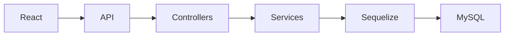

# ⚙️ Sistema de Calibração (Fullstack)

## 📚 Sumário

- Visão Geral
- Arquitetura
- Backend
- Frontend
- Fluxo da Aplicação
- Testes
- Roadmap
- Autor

## 📝 Visão Geral

Sistema Fullstack para gerenciamento e rastreabilidade metrológica de calibração de equipamentos industriais.

## 🏗️ Arquitetura

```text
sistema-calibracao/
├── backend/
└── frontend/
```

## ⚙️ Backend

### Tecnologias

| Categoria    | Tecnologia |
| ------------ | ---------- |
| Runtime      | Node.js    |
| Framework    | Express    |
| ORM          | Sequelize  |
| Banco        | MySQL      |
| Autenticação | JWT        |
| Upload       | Multer     |
| Logs         | Winston    |

### Instalação

```bash
cd backend
npm install
npm run start:dev
```

### Variáveis de ambiente

```env
PORT=3001
DB_HOST=
DB_USER=
DB_PASS=
DB_NAME=
JWT_SECRET=
```

## 🖥️ Frontend

### Tecnologias

- React
- React Router DOM
- Axios
- React Hot Toast
- React Icons

### Instalação

```bash
cd frontend
npm install
npm start
```

### Variáveis

```env
REACT_APP_API_URL=http://localhost:3001/api
PORT=3000
```

## 🔄 Fluxo



## 🧪 Testes

```bash
npm test -- --watchAll=false
```

## 🚀 Roadmap

- [x] Autenticação
- [x] Equipamentos
- [x] Calibrações
- [ ] Dashboard
- [ ] Exportação PDF

## 👨‍💻 Autor

**Moisés Barbosa dos Santos**

GitHub: https://github.com/IMoisasZ
